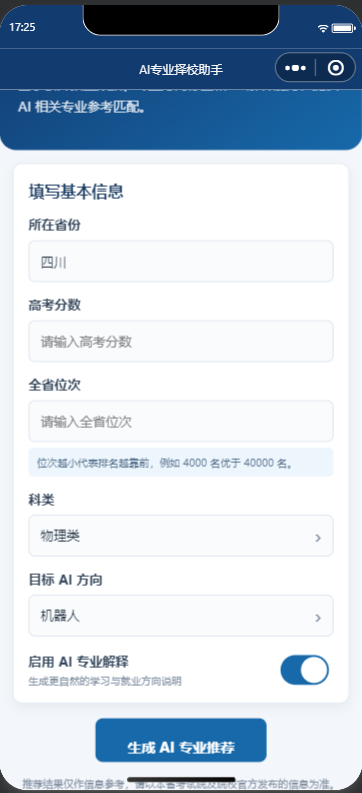
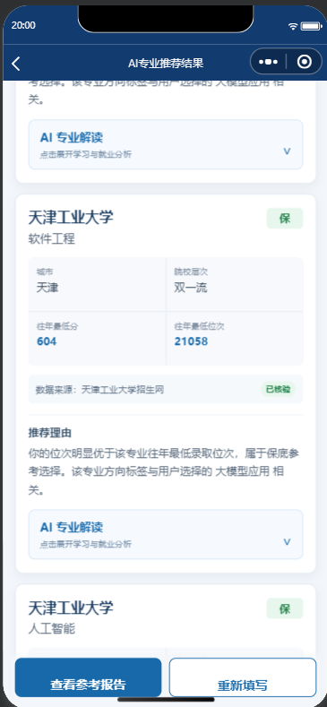
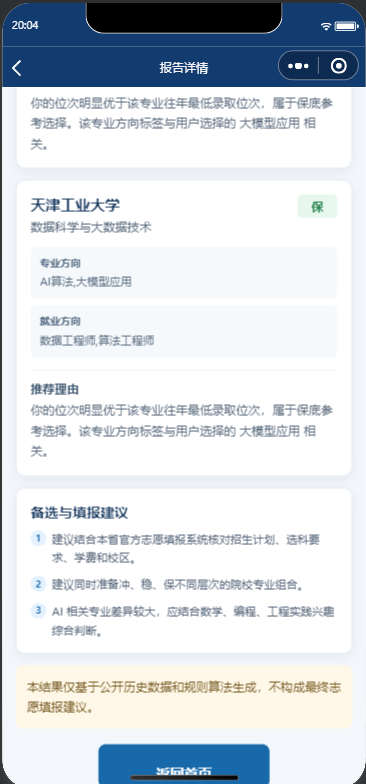
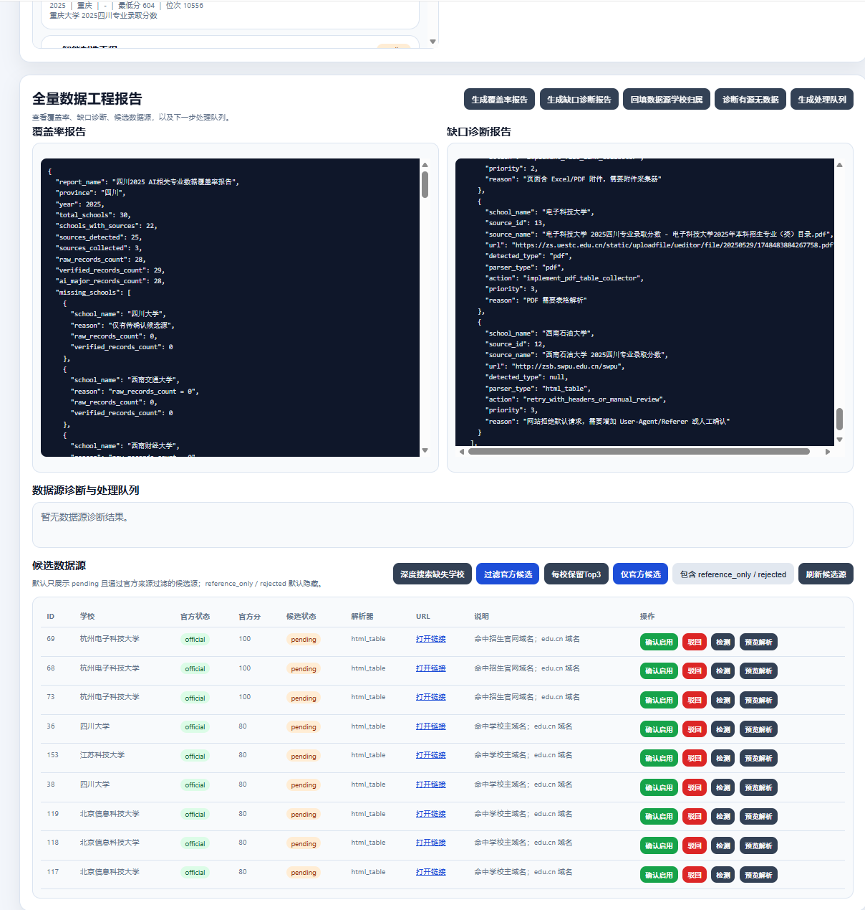
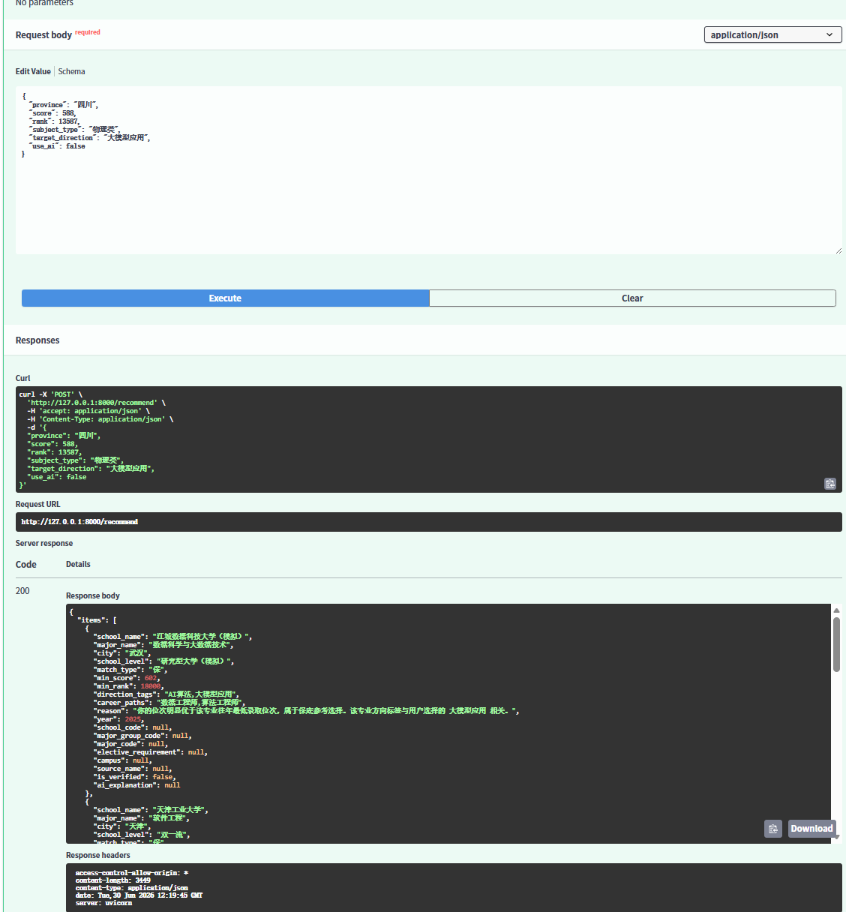
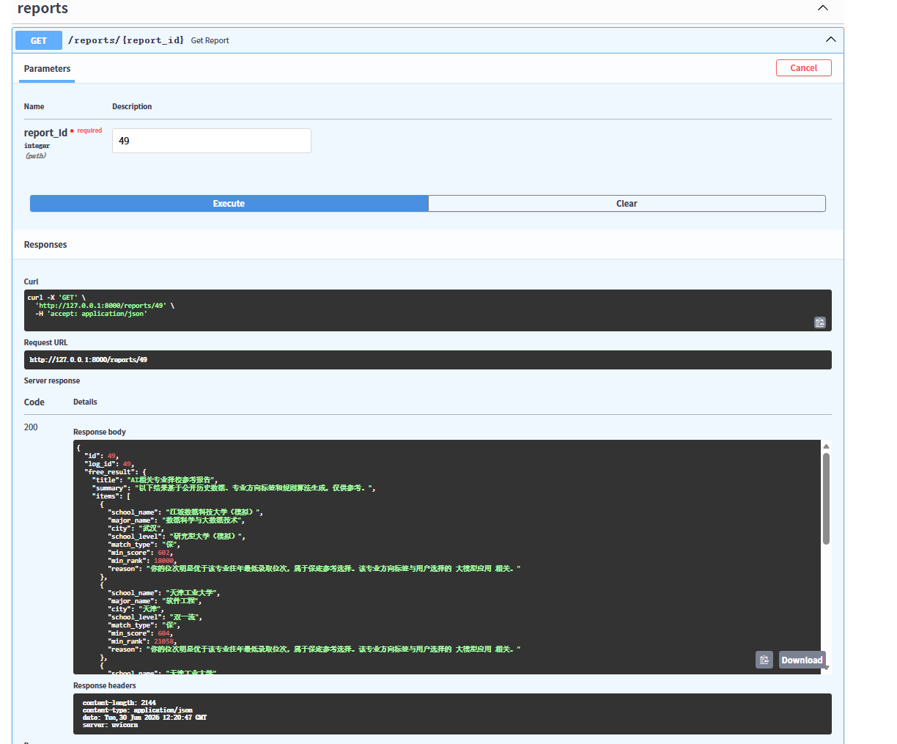
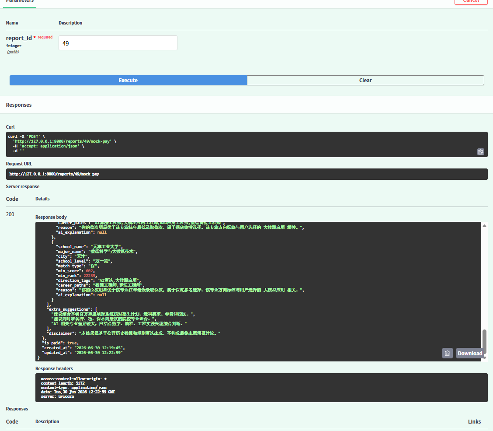

# AI专业择校助手

AI专业择校助手｜AI相关专业推荐与招生数据采集系统

## 30 秒看懂项目

一句话：这是一个围绕公开招生数据采集、人工核验、推荐匹配和 AI 解释生成的 AI 相关专业择校参考系统。

项目不是：

- 不是完整志愿填报系统
- 不承诺录取概率
- 不替代官方志愿填报

项目展示能力：

- FastAPI 后端开发
- 数据采集与清洗
- AI 应用接入
- 推荐接口设计
- 微信小程序前端
- admin 管理后台
- 数据治理闭环

演示入口：

- 后端 Swagger: [http://127.0.0.1:8000/docs](http://127.0.0.1:8000/docs)
- admin 后台: [http://127.0.0.1:8000/admin](http://127.0.0.1:8000/admin)
- 微信小程序：使用微信开发者工具打开 `miniprogram` 目录

## 适合面试展示的能力

- AI 应用开发：LLM API 接入、结构化输出、AI 解释生成和风险提示。
- Python 后端开发：FastAPI RESTful API、SQLite 数据建模、服务分层和错误兜底。
- 数据工程能力：公开数据源检测、HTML / Excel / PDF 解析、raw/admissions 双层数据治理。
- 产品闭环意识：微信小程序、admin 后台、推荐报告、mock-pay 演示流程。
- 工程取舍能力：明确数据验证集边界，不夸大为完整志愿填报系统。

## 求职材料快速索引

- 简历项目描述：[docs/RESUME_FINAL.md](docs/RESUME_FINAL.md)
- 面试口述稿：[docs/INTERVIEW_ORAL_SCRIPT.md](docs/INTERVIEW_ORAL_SCRIPT.md)
- 高频追问答题卡：[docs/INTERVIEW_FOLLOW_UP_CARD.md](docs/INTERVIEW_FOLLOW_UP_CARD.md)
- 5分钟演示流程：[docs/DEMO_5MIN_FLOW.md](docs/DEMO_5MIN_FLOW.md)
- 项目边界说明：[docs/DATA_SCOPE.md](docs/DATA_SCOPE.md)

> 重要说明：当前数据为部分高校公开数据验证集，项目用于技术展示和作品集演示，不作为真实志愿填报依据，不承诺录取概率，也不构成最终志愿填报建议。

## 项目简介

用户输入省份、分数、位次、科类和目标 AI 方向后，系统基于已核验的 admissions 正式数据，返回 Top5 院校专业参考结果，并给出冲 / 稳 / 保、往年最低分、最低位次、数据来源和风险提示。

如果启用 AI 解释，系统会基于推荐结果生成专业学习重点、适合人群、就业方向和风险说明。AI 只负责解释，不直接决定推荐哪所学校或专业。

项目同时提供本地 admin 管理后台，用于数据源管理、采集预览、采集日志、raw 数据核验、覆盖率报告和缺口诊断。

## 在线演示 / 本地演示

本项目当前以本地演示为主。

启动后端：

```bash
python -m uvicorn main:app --reload
```

访问：

```text
Swagger: http://127.0.0.1:8000/docs
Admin:   http://127.0.0.1:8000/admin
Health:  http://127.0.0.1:8000/health
```

微信小程序可使用微信开发者工具打开 `miniprogram` 目录。

## 功能模块

- 学校 / 专业 / 录取数据基础 CRUD
- `POST /recommend` 推荐接口
- AI 解释服务
- 推荐日志和报告结构
- mock-pay 模拟解锁完整报告
- raw_admission_records 原始招生数据表
- admissions 正式推荐数据表
- raw_data_sources 数据源配置表
- 数据源搜索、检测、预览和采集
- HTML / Excel / PDF 采集器
- collector_runs 采集日志
- coverage report 覆盖率报告
- gap diagnosis 缺口诊断
- admin 数据治理后台
- 微信小程序首页、推荐结果页、报告页、合规说明页

## 技术栈

- Python
- FastAPI
- SQLite
- Pydantic
- python-dotenv
- requests
- BeautifulSoup
- openpyxl
- pdfplumber
- OpenAI-compatible LLM API
- 原生微信小程序 JavaScript
- 原生 HTML / CSS / JavaScript admin 后台

## 系统架构

```text
微信小程序 / Swagger / Admin
        ↓
FastAPI routers
        ↓
services 业务服务
        ↓
crud 数据访问
        ↓
SQLite
```

数据采集侧：

```text
raw_data_sources
        ↓
source check / preview / collectors
        ↓
raw_admission_records
        ↓
人工核验
        ↓
admissions
        ↓
recommend
```

## 数据流程

1. 管理员配置或发现数据源。
2. 系统检测 URL 可采性。
3. 管理员执行采集预览，查看表头、映射字段和跳过原因。
4. 采集器将数据写入 raw_admission_records，状态为 pending。
5. 管理员在 admin 后台人工核验。
6. 核验通过后写入 admissions。
7. recommend 接口只使用 admissions 中的正式数据。

自动采集数据不会直接用于推荐。

## AI 能力说明

AI 解释服务用于生成：

- 推荐理由
- 学习重点
- 适合人群
- 就业方向
- 风险提示

推荐排序仍然由规则算法和已核验数据决定。AI 不参与决定推荐哪所学校。

## 后台管理功能

admin 后台支持：

- 数据源新增、编辑、检测
- 单源采集和全量采集
- HTML 表格预览解析
- 附件链接提取
- 采集日志查看
- raw 数据详情查看
- raw 数据核验通过 / 驳回
- 覆盖率报告
- 缺口诊断
- 候选数据源官方过滤和 Top3 保留

## 数据范围与免责声明

当前数据范围：

- 四川省为主
- 2025 年为主
- 物理类优先
- AI / 计算机 / 软件 / 电子信息 / 自动化等相关专业
- 部分已核验高校公开数据

本项目不是完整高考志愿填报系统，不承诺覆盖所有高校，不承诺录取概率，不构成最终志愿填报建议。

实际填报应以省级招生考试机构、阳光高考平台、高校招生官网、招生章程和官方志愿填报系统为准。

## 本地运行

```bash
python -m venv .venv
```

Windows PowerShell：

```powershell
.\.venv\Scripts\Activate.ps1
pip install -r requirements.txt
python -m uvicorn main:app --reload
```

如果已经有 `.venv`：

```powershell
.\.venv\Scripts\python.exe -m uvicorn main:app --reload
```

准备演示数据标记：

```powershell
.\.venv\Scripts\python.exe scripts\prepare_demo_dataset.py
```

项目健康检查：

```powershell
.\.venv\Scripts\python.exe scripts\project_check.py
```

## API 示例

推荐接口：

```http
POST /recommend
```

请求示例：

```json
{
  "province": "四川",
  "score": 603,
  "rank": 22000,
  "subject_type": "物理类",
  "target_direction": "AI算法",
  "use_ai": true
}
```

返回结果会包含：

- `log_id`
- `report_id`
- `items`
- `school_name`
- `major_name`
- `match_type`
- `min_score`
- `min_rank`
- `source_name`
- `is_verified`
- `ai_explanation`
- `disclaimer`

报告接口：

```http
GET /reports/{report_id}
```

模拟解锁：

```http
POST /reports/{report_id}/mock-pay
```

## 项目亮点

- raw/admissions 双层数据模型
- Human-in-the-loop 人工核验流程
- 数据来源可追溯
- 推荐结果可解释
- AI 只做解释，不做不可控决策
- 支持 HTML / Excel / PDF 多类公开数据解析
- 支持采集预览、表头识别、字段映射和跳过原因展示
- 覆盖率报告和缺口诊断
- admin 后台支持数据治理闭环
- 微信小程序展示端 + FastAPI 后端 + 本地管理后台完整联动

## 后续优化

- 增加管理员登录和权限控制
- SQLite 迁移到 PostgreSQL
- 引入任务队列处理采集任务
- 增加数据版本管理和操作审计
- 提升 PDF / Excel 复杂表格解析能力
- 增加更多省份和年份的数据验证集
- 将 mock-pay 替换为真实支付回调
- 完善正式隐私政策和合规授权流程

## 项目截图

### 小程序首页



### 推荐结果页



### AI解释报告页



### Admin 管理后台



### Swagger API 文档

#### 接口总览



#### 推荐接口



#### 报告接口



## 求职包装材料

- [简历项目描述](docs/RESUME_PROJECT.md)
- [项目介绍压缩版](docs/ELEVATOR_PITCH.md)
- [面试高频问答压缩版](docs/INTERVIEW_QA_SHORT.md)
- [技术亮点拆解](docs/TECH_HIGHLIGHTS.md)
- [项目不足与后续优化](docs/PROJECT_LIMITATIONS.md)
- [岗位匹配说明](docs/JOB_MATCHING.md)
- [GitHub 发布前检查清单](docs/README_CHECKLIST.md)

## 更多文档

- [项目概览](docs/PROJECT_OVERVIEW.md)
- [数据范围与免责声明](docs/DATA_SCOPE.md)
- [演示脚本](docs/DEMO_SCRIPT.md)
- [部署说明](docs/DEPLOYMENT.md)
- [面试讲解稿](docs/INTERVIEW_NOTES.md)
